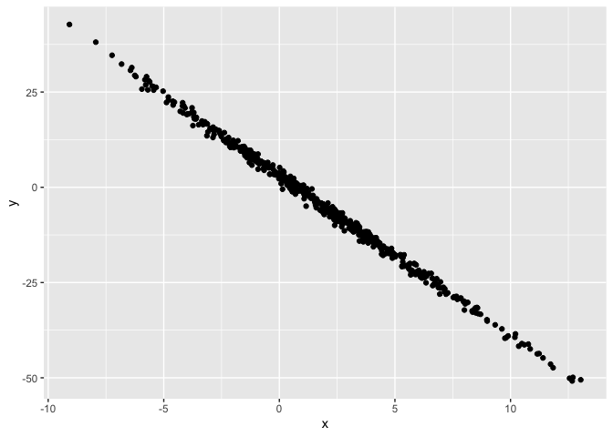

Simple document
================
Nhu Nguyen
August 2020

I’m an R Markdown document!

# Section 1

Here’s a **code chunk** that samples from a *normal distribution*:

``` r
# this is a comment -- outside of the code chunk is not code
samp = rnorm(100)
length(samp)
```

    ## [1] 100

# Section 2

I can take the mean of the sample, too! The mean is -0.0600898. - you
can compute the mean of a sample

# Section 3

### data frame and plot

The code chunk below creates a data frame and generates a plot

``` r
library(tidyverse)
```

    ## ── Attaching core tidyverse packages ──────────────────────── tidyverse 2.0.0 ──
    ## ✔ dplyr     1.1.3     ✔ readr     2.1.4
    ## ✔ forcats   1.0.0     ✔ stringr   1.5.0
    ## ✔ ggplot2   3.4.3     ✔ tibble    3.2.1
    ## ✔ lubridate 1.9.2     ✔ tidyr     1.3.0
    ## ✔ purrr     1.0.2     
    ## ── Conflicts ────────────────────────────────────────── tidyverse_conflicts() ──
    ## ✖ dplyr::filter() masks stats::filter()
    ## ✖ dplyr::lag()    masks stats::lag()
    ## ℹ Use the conflicted package (<http://conflicted.r-lib.org/>) to force all conflicts to become errors

``` r
plot_df = tibble(
  x = rnorm(500, mean = 2, sd = 4),
  y = 3 - 4.2 * x + rnorm(500)
)

ggplot(plot_df, aes(x = x, y = y)) + geom_point()
```

<!-- --> this plot is
really good! it shows a linear relation just as expected.

the data frame has 500 rows.

here is a list:

- This is my first list items
- lists need at least two items
  - this list has a sub item
- third list item

\###table

| col 1 | col 2 |
|-------|-------|
| a     | b     |
| c     | d     |

> this is a block quote.
